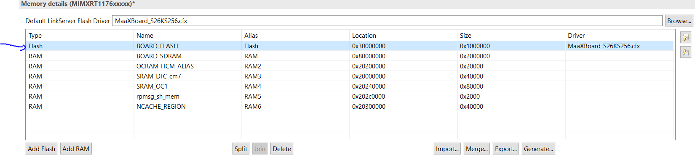
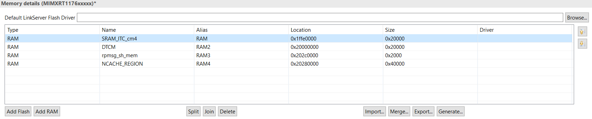
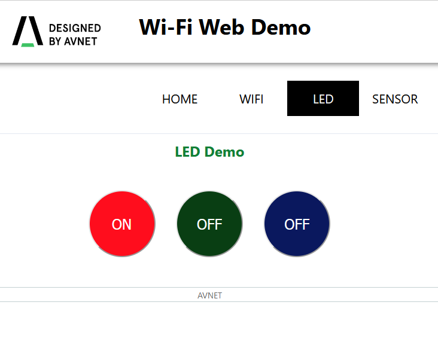
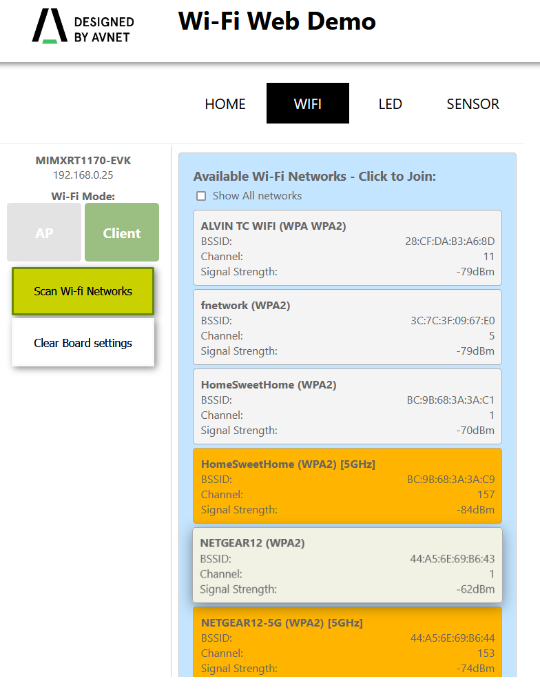
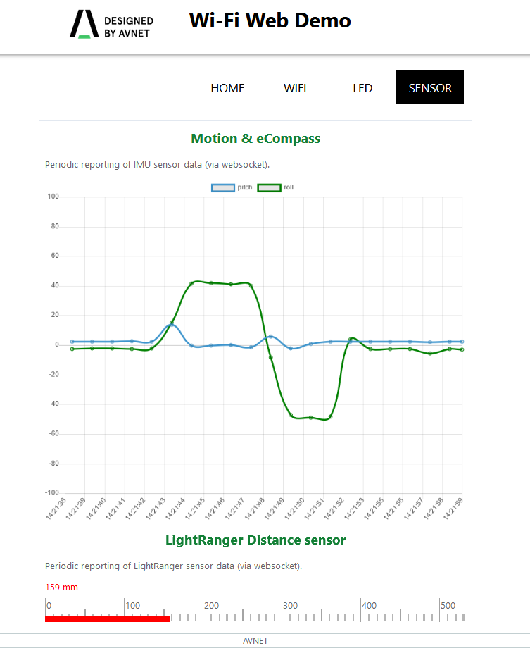

# MaaXBoard-RT-Webserver Demo

This program utilizes m7, m4 cores to demonstrate headless webserver on the i.mxrt1170 MCU.
Application program is partitioned in following way:
- webserver. (m7)
    1. LWIP stack based httpserver serving wifi, led, sensor pages.
    2. wifi softAP or client
    3. Hyperflash as configuration storage    
- sensor acquisition using i2c. (m4)
    1. [6DOF IMU 3 CLICK](https://www.mikroe.com/6dof-imu-3-click)
    2. [LightRanger 8 CLICK](https://www.mikroe.com/lightranger-8-click)
    
**Table of Contents**

1. [Required Hardwares](#Required-Hardwares)
	1. [MaaXBoard RT board](#Maaxboard-RT-board)
    2. [MCU-Link debug probe](#mcu-link-debug-probe)

2. [Mode of Operation](#mode-of-operation)
    1. [SoftAP mode](#console-mode)
    2. [Wifi client mode](#gui-mode)    
3. [Project structure](#project-structure)
4. [Customization](#customization)
    1. [Frontend](#frontend)
    2. [Backend]($backend)

# Required Hardwares

## MaaXBoard-rt-board 

[](https://www.avnet.com/wps/portal/us/products/avnet-boards/avnet-board-families/maaxboard/maaxboard-rt/)
- NXP i.MX RT1176 Processor
- Arm Cortex-M7 @1GHz, 32KB/32KB L1 Cache
- Arm Cortex-M4F @400MHz, 16KB/16KB L1 Cache
- Fast Real-time, low-latency response (12ns)
- 2D GPU and Graphics Accelerator
- Advanced Security (on RT1176 plus TO136 Device)
- 2MB of Fast On-Chip SRAM
- (includes 512KB of A7 TCM and 256KB M4 TCM)
- 256 Mb Onboard SDRAM
- 256 Mb Onboard HyperFlash

## MCU-Link debug probe

[](https://www.avnet.com/wps/portal/us/products/avnet-boards/avnet-board-families/maaxboard/maaxboard-rt/)

# Mode of Operation
## softAP mode
MaaXBoard will run in softAP mode if there is no ssid, password is stored on the hyperflash. Hyperflash has size of 32MB. Currently first 16MB is used for program flash, later 16MB is for storage.

Following definition must be set in the project. This is the physical address where configuration is stored. (16777216 = 0x1000000)
```
MFLASH_FILE_BASEADDR=16777216
```

<br/>
Once softAP is started, user may connect to following wifi: 
<br/>
ssid: **"maaxboard_access_point"** password: **"maaxboard123"**
<br/>
on a browser, connect to 192.168.1.1

## Wifi Client Mode
In this mode, maaxboard will connect to pre-stored ssid, password on the hyperflash. User can see the actual assigned IP on the serial console.

```
Starting MaaXBoard Webserver DEMO
[i] Trying to load data from mflash.
[i] Saved SSID: NETGEAR12, Password: aquaticpotato000
[i] Initializing WiFi connection...
MAC Address: D4:53:83:C0:A3:FE
[net] Initialized TCP/IP networking stack
WLAN initialized
WLAN FW Version: w8987o-V0, RF878X, FP91, 16.91.10.p200, WPA2_CVE_FIX 1, PVE_FIX 1
[i] Successfully initialized WiFi module
Connecting as client to ssid: NETGEAR12 with password aquaticpotato000
        Connected to following BSS:SSID = [NETGEAR12], IP = [192.168.0.25]
[i] Connected to Wi-Fi
ssid: SSID
[!]passphrase: password
 Now join that network on your device and connect to this IP: 192.168.0.25
```

# Project Structure
There are two projects used. Each project is running FreeRTOS tasks.
- maaxboard_webserver_MASTER(m7 as Master)
    1. WIFI_TASK (Wifi initialize, http server)
    2. APP_TASK (start m4 core via MCMGR (Multicore Manager), fetch sensor value from m4)
- maaxboard_webserver_M4Slave(m4 as Slave)
    1. IMU_TASK (read [6DOF IMU 3 CLICK](https://www.mikroe.com/6dof-imu-3-click))
    2. LR_TASK (read [LightRanger 8 CLICK](https://www.mikroe.com/lightranger-8-click))
    3. MC_TASK (send sensor values to M7 core)

Inter-core communication uses [message buffer](https://www.freertos.org/RTOS-message-buffer-example.html) using statically memory **"rpmsg_sh_mem"** at location 0x202c0000 with size of 0x2000. This shared memory is fixed location and known for both cores. This can be adjusted in the linker file.



Following folder structures are useful for user.
* `src/`
	* web source files (.css .js .html)
* `sources/`
	* application source files
* `board/`
	* `board.c/h`
		* board specific definitions
	* `clock_config.c/h`
		* generated clock configuration from MCUXpresso configurator
	* `pin_mux.c/h`
		* generated pin configuration from MCUXpresso configurator
	* lvgl graphics library version 7.11
* `wifi/`
	* wifi driver, bluetooth firmware

# Demo




# Customization
## Frontend
At the front-end, all the sources are stored inside `src/wifi_common/webconfig/webui`. LWIP stack provides perl script which converts whole web frontend sources into compilable single `.c` file. It is located at the `src/wifi_common/webconfig/webui/mkfs.pl`.

script requies only the folder as a parameter. It will convert all `.jpg, .html, .css, js, ...` into httpsrv_fs_data.c which contains constant arrays and its pointers. 
```
perl mkfs.pl webui
```
Current project utilizes 7.33% of 32MB total flash. So there is plenty of room adding more pages.

## Backend
LWIP webserver supports CGI (Common Gateway Interface). Webserver recognizes http GET/POST request and invokes a registered call back functions.

On line #75 of `source/main_m7.c`, there is cgi link array is defined. User can define more cgi link or modify the current callback functions.

```
For example: GET 192.168.xx.yy/led.cgi will invoke cgi_led() function.
```
```
const HTTPSRV_CGI_LINK_STRUCT cgi_lnk_tbl[] = {
	{"led", cgi_led},               // led control
    {"reset", CGI_HandleReset},     // reset wifi
    {"get", CGI_HandleGet},         // wifi scan
	{"imu", CGI_HandleGetSensor},   // get IMU, lightranger sensor value
    {"post", CGI_HandlePost},       // set new SSID, password
    {"status", CGI_HandleStatus},   // get wifi status
    {0, 0} // DO NOT REMOVE - last item - end of table
};
```
*Note: Both GET/POST method will invoke the given callback function.*

Example callback function:
```
static int CGI_Example(HTTPSRV_CGI_REQ_STRUCT *param)
{
    char[] data = "OK"; // dummy text data
    HTTPSRV_CGI_RES_STRUCT response = {0};
    response.ses_handle  = param->ses_handle;
    response.status_code = HTTPSRV_CODE_OK;    
    response.content_type   = HTTPSRV_CONTENT_TYPE_PLAIN;    
    response.data           = data;
    response.data_length    = strlen(data);
    response.content_length = response.data_length;
    HTTPSRV_cgi_write(&response);
    return (response.length);
}
```
# Reference

* [MaaXBoard-rt](https://www.avnet.com/wps/portal/us/products/avnet-boards/avnet-board-families/maaxboard/maaxboard-rt/)
